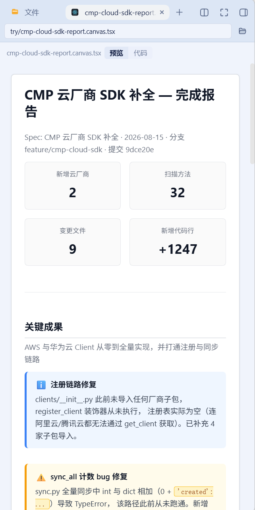

# dsh-canvas-tsx-sidebar

[简体中文](README.md) | [Français](README.fr.md) | [Deutsch](README.de.md) | [Italiano](README.it.md) | [Русский](README.ru.md) | [Español](README.es.md)

Web-Plugin für DSH (DeepSeek Harness) — **Consumer-Plugin für dsh-better-sidebar**.

Parst die `*.canvas.tsx`-Dateien des Qoder Canvas im Workspace **statisch** in strukturierte Seiten und rendert sie in der rechten Seitenleiste von DSH.

> **Rein statische Pipeline**: Der Canvas-Quellcode wird nicht ausgeführt. Kein `eval`, kein `new Function`, kein Bundler, kein Sandbox-iframe.
> Das Parsen übernimmt browserseitig ein selbst entwickelter, leichtgewichtiger Recursive-Descent-Parser (null Parser-Abhängigkeiten).

Dieses Repository bringt zudem einen **Skill** mit: `skills/writing-qoder-canvas/`, der LLMs beibringt, dieses Format zu schreiben. Siehe [Skill-Integration](#skill-integration-llms-das-schreiben-von-canvastsx-beibringen).



**Kompatibilitätsumfang**: **DSH-0.2.0-Linie** (diese Linie) — `engines.dsh` ist `>=0.2.0-rc.1 <0.2.1-0`, getestete Basis: dsh-client-locale 0.2.0-rc.1, Veröffentlichung über den npm dist-tag **`dsh-0.2.0`**. 0.2.0 ist für alle Host-APIs, die dieses Plugin nutzt, rein additiv (das Plugin konsumiert nur `register(ns, locale, dict)` / `bind(ns)` von dsh-client-locale; die Client-Exportfläche ist identisch mit 0.1.7-rc.2) — die Unterstützungslinie wird daher insgesamt nach vorn verschoben, ein Laufzeit-Kompatibilitätszweig ist nicht nötig. **Plugin-Version immer nach DSH-Version wählen** (nicht blind `latest` auf älteren Hosts — die `engines` des alten Hosts werden dann nicht erfüllt und das Plugin wird von der Start-Vorprüfung still deaktiviert; Caret-Bereiche gelten auch nicht über Host-Minor-Versionen hinweg):

| DSH-Host | Neueste Plugin-Version | Installations-dist-tag |
|---|---|---|
| 0.2.0 | **0.5.0** (latest) | `dsh-0.2.0` |
| 0.1.7 | 0.4.0 | `dsh-0.1.7` |
| 0.1.5 | 0.3.2 | `dsh-0.1.5` |
| 0.1.2 | 0.2.2 | `dsh-0.1.2` |
| 0.1.1 und früher | nicht unterstützt (die 0.1.2-Linie hat die Untergrenze 0.1.2-rc.1) | — |

(Stand: 2026-09-30; ältere Linien werden von `compat/0.1.7` sowie den eingefrorenen Zweigen `compat/0.1.5` und `archive/release/0.1.2` bedient.)

---

## Voraussetzungen

- DSH `dsh web` läuft fehlerfrei
- [dsh-better-sidebar](https://www.npmjs.com/package/dsh-better-sidebar) ist installiert (`>=0.19.1`)

Ohne better-sidebar bleibt das Plugin **vollständig inert**: Beide Registrierungen werden stillschweigend übersprungen, andere DSH-Funktionen bleiben unbeeinträchtigt.

## Installation

### Methode A (empfohlen, offizielle CLI)

```sh
# dist-tag je nach DSH-Host-Version wählen (empfohlen, kein blindes latest)
dsh plugin --profile <profile> add dsh-canvas-tsx-sidebar@dsh-0.2.0   # DSH-0.2.0-Linie (0.5.0)
dsh plugin --profile <profile> add dsh-canvas-tsx-sidebar@dsh-0.1.7   # DSH-0.1.7-Linie (0.4.0)
dsh plugin --profile <profile> add dsh-canvas-tsx-sidebar@dsh-0.1.5   # DSH-0.1.5-Linie (0.3.2)
dsh plugin --profile <profile> add dsh-canvas-tsx-sidebar@dsh-0.1.2   # DSH-0.1.2-Linie (0.2.2)
# Alternative: lokales Tarball (diese Linie: dsh-canvas-tsx-sidebar-0.5.0.tgz)
dsh plugin --profile <profile> add <dsh-canvas-tsx-sidebar-0.5.0.tgz>
```

`dsh` trägt dieses Paket in `dsh.profile.bundles` ein; beim Start fügt die im Paket enthaltene `cordis.patch.yml` den Loader-Eintrag ein, und das Client-Bundle wird gemäß `entry.name` registriert und ausgeliefert.

### Methode B (manuell, Alternative)

1. Das Paket nach `~/.dsh/profiles/<profile>/node_modules/dsh-canvas-tsx-sidebar` kopieren
   (oder im `package.json` des Profils unter `dependencies` `"dsh-canvas-tsx-sidebar": "link:<Plugin-Pfad>"` eintragen);
2. folgende Zeile an `~/.dsh/profiles/<profile>/cordis.patch.yml` anhängen:

   ```yaml
   - insert:
       - id: dsh-canvas-tsx-sidebar
         name: dsh-canvas-tsx-sidebar
   ```

3. im Profilordner `pnpm install` ausführen.

> ⚠️ **Entweder Methode A oder Methode B — nicht doppelt registrieren.**

### Aktivierung

4. **`dsh web` neu starten** — ein neu hinzugefügtes Bundle erfordert ein Neuladen auf Host-Seite (nur Client-Änderungen an **bereits eingebundenen** Plugins werden per Hot Reload geladen);
5. Browser hart aktualisieren (Ctrl+Shift+R).

Den Mount-Status kann man mit `pwsh -NoProfile -File ./scripts/mount-check.ps1` erneut prüfen.

## Verwendung

Zwei Einstiegspunkte:

| Einstieg | Auslösung | Verhalten |
|---|---|---|
| **Datei-Viewer** (Übernahme) | Beliebige `.tsx` im Dateibaum öffnen | `.canvas.tsx` → strukturierte Seite + Umschalter `Vorschau/Code`; andere `.tsx` → Quellcode-Ansicht |
| **Tab** | `+`-Menü der rechten Seitenleiste → **Canvas-Bericht** | Pfad manuell eingeben und ansehen, ohne die Datei vorher im Editor zu öffnen |

Der Datei-Viewer lässt sich in den Einstellungen der Side-Karte deaktivieren; danach fällt dieser Dateityp auf den integrierten Code-Viewer zurück.

Wird **eine** Datei geöffnet, wird genau **diese** Datei gerendert — das Plugin scannt den Workspace nicht.

### Warum der Datei-Viewer alle .tsx beanspruchen muss

`exts: ['tsx']` ist die einzige tragfähige Art der Beanspruchung — der Preis ist, dass damit auch Nicht-Canvas-`.tsx` beansprucht werden. Alle Belege stammen aus dem better-sidebar-Quellcode und aus Praxistests im Ökosystem:

| # | Zwang | Beleg |
|---|---|---|
| L1 | `extOf()` nimmt nur das letzte Erweiterungssegment → `extOf('a.canvas.tsx') === 'tsx'` | `src/client/paths.ts:80-85` |
| L2 | `exts: ['tsx']` beansprucht **alle** `.tsx` im Workspace, und priority 0 überstimmt das CodeMirror des eingebauten `code` (-100) | `service.ts:847-875` |
| L3 | `detect` wird nur aufgerufen, wenn `head`-Bytes verfügbar sind, und `head` stammt nur aus binärem `fs.read` — textuelle `.tsx` erreichen diesen Zweig nie | `service.ts:860` |
| L4 | nach der Beanspruchung durch den Descriptor muss `component` rendern, **keine Delegations-/Fallback-API** | `EditorHost.tsx:349,486` |
| L5 | das Ökosystem-Plugin `dsh-code-nav` führt `tsx` bereits in seinem `LANG_EXT` und beansprucht mit `priority: 10` | `dsh-code-nav/src/lang-registry.js` |

→ Die Erkennung von `.canvas.tsx` kann daher nur innerhalb der eigenen Komponente erfolgen. Konsequenz: **Der Viewer beansprucht alle `.tsx`** (Canvas läuft auf die Seite, alles Übrige auf den Quellcode), und der **Tab** bleibt als zweiter Einstiegspunkt erhalten, der ohne Datei-Beanspruchung auskommt.

## Skill-Integration: LLMs das Schreiben von .canvas.tsx beibringen

`skills/writing-qoder-canvas/` ist ein **in sich geschlossener, vollständig verlagerbarer** Skill:

```
skills/writing-qoder-canvas/
  SKILL.md                      # Auslösebedingungen, Datei-Skelett, fünf eiserne Regeln, Liste der Warnsignale
  references/components.md      # die 38 wirklich gerenderten Tags + deren Props (maschinell geprüft)
  references/expressions.md     # die abgeschlossenen Regeln des statischen Parsers: welche Werte überleben
  references/layout.md          # schreiben für eine ~400px-Seitenleiste (nicht für die 960px-Vorschau)
  examples/status-report.canvas.tsx   # ein renderbares Muster, von Tests als null-degradiert garantiert
```

### Warum er nicht lügt

Dokumentation driftet, daher ist hier jede Behauptung an den Quellcode gekoppelt (`tests/skill.spec.ts`):

- die Unterstützungsliste in `components.md` muss **elementweise exakt** den `case`-Tags von `render.tsx` entsprechen (38 Stück, Reihenfolge eingeschlossen);
- kein Name aus der Liste der Nicht-Unterstützten darf im Renderer auftauchen;
- `examples/status-report.canvas.tsx` muss **ohne jede Degradation** rendern — kein `unsupported`-Hinweis, kein gestrichelter Rahmen für unbekannte Komponenten.

Weichen Dokumentation und tatsächliche Fähigkeiten voneinander ab, schlägt `pnpm test` fehl.

### So wird er in DSH installiert

DSH findet Skills in einer festen Menge von Roots, und ein Skill muss **genau eine Ebene tief** liegen: `<root>/<name>/SKILL.md`.
Verschachtelte `**/SKILL.md` werden nicht gefunden (der Provider überwacht jeden Root mit chokidar, `depth: 1`).

| rank | Quelle | Pfad |
|---|---|---|
| 100 | `project-dsh` | `<projectRoot>/.dsh/skills` |
| 200 | `project-agents` | `<projectRoot>/.agents/skills` |
| 300 | `custom` | `customSkillDirs` der DSH-Konfiguration |
| 400 | `user-dsh` | `~/.dsh/skills` |
| 500 | `user-agents` | `~/.agents/skills` |
| 600 | `bundled` | `$DSH_BUNDLED_SKILL_DIR` |

```powershell
# Standard: Installation nach ~/.agents/skills per Junction (keine Kopie, kein Drift)
pwsh -NoProfile -File ./scripts/install-skill.ps1

# Installation an einem anderen Ort; -Copy erzeugt eine echte, unabhängig verlagerbare Kopie (driftet, nach Änderungen neu ausführen)
pwsh -NoProfile -File ./scripts/install-skill.ps1 -Target UserDsh
pwsh -NoProfile -File ./scripts/install-skill.ps1 -Path D:\some\skills -Copy

# Deinstallation
pwsh -NoProfile -File ./scripts/install-skill.ps1 -Uninstall
```

Der Provider überwacht die Roots, **ein Neustart von `dsh web` ist nicht nötig**: Nach der Installation erscheint der Skill im Skill-Katalog der nächsten Sitzung.

**Standard ist eine Junction statt einer Kopie**, denn Kopien driften — dieser Workspace hat das bei `memport` bereits am Fall „drei Kopien, nie synchron" gelernt. Die Junction macht die Kopie im Repository stets zur allein maßgeblichen Quelle.

> `skills/` steht **nicht in den `files[]` der `package.json`** — es ist ein Repository-Asset, kein npm-Artefakt.

## Versionsbeschränkungen

Unter `dsh-better-sidebar@0.19.0 / 0.19.1` wird der path seed von `openTab({ path })` zum Datei-Editor umgeleitet, und **Komponenten-Tabs werden nicht gemountet** (upstream #632, behoben ab 0.19.2). Dieses Plugin hängt daher **nicht vom path seed** ab, sondern löst die Zieldatei selbst über `/sidebar/api` auf (`session.cwd` → `fs.tree` → `fs.read`) — ein Ansatz, der gleichermaßen für 0.19.2+ gilt.

## Skins und Themes

**Die Plugin-Hülle** (Tabs, Einstellungs-Karte, Buttons) konsumiert nur die `--dsw-alias-*`-Tokens von DSH und folgt damit automatisch allen Skins sowie dem Hell-/Dunkelmodus.

**Der Unterbaum der canvas-Dokumente ist die Ausnahme — mit Absicht**: Ein `.canvas.tsx` beschreibt ein Blatt mit festem Layout, dessen Farben der Autor bestimmt; eine Umfärbung nach Skin würde das Aussehen des Berichts selbst verändern. Daher arbeitet `styles.ts` mit literalen Farbwerten, und **jeder Selektor ist auf `.dsh-canvas-doc` beschränkt**, ohne Leakage in die Host-UI (`tests/render.spec.tsx` bewacht den Geltungsbereich, `tests/purity.spec.ts` die Registrierungsfläche).

## Bekannte Einschränkungen

- Das Parsen nutzt einen **leichtgewichtigen, selbst entwickelten Parser**, keine Compiler-Präzision. Generics, Decorators und beliebige Aufrufe werden nicht modelliert und durchweg degradiert — aber es wird **nie ein Fehler geworfen**.
- Das Auswerten von Werten folgt einer **abgeschlossenen Regelmenge** (Details in `skills/writing-qoder-canvas/references/expressions.md`).
  Unterstützt: Literale, `as const`-/`as T`-Assertions, literale `const` auf Modulebene und am Kopf eines Funktionskörpers,
  `ARR.map(x => Literal)`-Projektionen auf statische Arrays, `canvasImage('Literal')`.
  Nicht unterstützt (**keine Auswertung**): bedingte Ausdrücke, Funktionsaufrufe, Member-Ketten, Template-Interpolation, Arithmetik, `new`, `await`,
  `const` in verschachtelten Blöcken, Daten aus modulübergreifenden `import`s.
  - ein **Kindknoten** ohne Literal → als Inline-Degradationsbalken gerendert, das Originalfragment bleibt sichtbar;
  - eine **Eigenschaft** ohne Literal → die Eigenschaft wird verworfen, ihr Name landet im `unresolved` der IR, alle übrigen Eigenschaften werden normal gerendert.
- Kleingeschriebene Tags werden durchweg als natives HTML durchgereicht; nur **großgeschriebene, nicht abgebildete** Komponenten werden als benannter gestrichelter Rahmen gerendert.
- Tabs werden **schreibgeschützt** gerendert.
- **Der Parser ist toleranter als ein Compiler**: Das Qoder-SDK verlangt von Autoren, Diagnostics über den „Canvas TypeScript check" der IDE zu beseitigen, doch echte Dateien sind nicht immer sauber. Bei illegalem TSX wirft dieses Plugin **keinen Fehler und bricht nicht ab**, sondern degradiert nur den betroffenen Knoten.
  Die maßgeblichen Diagnostics lassen sich mit `node scripts/syntax-oracle.cjs <file.canvas.tsx>` anzeigen.

  > Praxistest: Zeile 46 des mitgelieferten Beispiels `cmp-cloud-sdk-report.canvas.tsx`,
  > `{'created': ...}`, ist illegales TSX (TypeScript meldet **TS1005 + TS1381** — nackter Spread-Operator).
  > Das Plugin degradiert diese Stelle zu einem Inline-Marker und rendert die übrigen 147 Zeilen normal.

## JSX-Leerzeichen-Semantik

Text-Kindknoten werden streng nach der `cleanJSXElementLiteralChild`-Semantik von React zusammengefaltet:

- **die Einrückung am Zeilenanfang wird auf jeder Nicht-Erstzeile stets entfernt**;
- **die Leerzeichen am Ende der letzten Zeile bleiben erhalten** — dieses Leerzeichen ist tragend: Es trennt den Text vom unmittelbar folgenden Ausdrucks-Container
  (Beispiel: das Leerzeichen in `…Addition (0 + {'created': ...})…`; fehlt es, kleben beide Segmente aneinander).

## Entwicklung

```sh
pnpm install
pnpm typecheck     # tsc (inkl. Prüfung auf null Node-Abhängigkeiten im reinen Client)
pnpm test          # vitest
pnpm build         # tsc dts + tsdown (Host-Teil + Client-Bundle)
pnpm run audit:bundle   # Audit der realen Build-Artefakte
```

## Entwicklungsskripte

| Skript | Zweck |
|---|---|
| `scripts/dump-ir.ts` | IR-Gliederung / JSON / Golden-Fixtures einer Datei exportieren (`--write`) |
| `scripts/syntax-oracle.cjs` | Prüft mit dem **echten TypeScript-Compiler**, ob eine Quelldatei gültiges TSX ist (`typescript` bleibt devDependency und gelangt nicht in den Bundle) |
| `scripts/audit-bundle.cjs` | Audit der realen Build-Artefakte: Leaks eingebauter Module, Re-Parser, `eval`, unzulässige Registrierungen |
| `scripts/mount-check.ps1` | Profil-Mount prüfen/reparieren (reines ASCII, kompatibel mit Windows PowerShell 5.1) |
| `scripts/install-skill.ps1` | Installiert `skills/writing-qoder-canvas` in einen DSH-Skill-Root (Standard: Junction) |
| `scripts/component-census.cjs` | Eigenständige Komponentenzählung (ohne hart kodierte Komponententabelle, mehrzeilensensitiv) |
| `scripts/corpus-stats.ts` / `format-economics.ts` / `audit-corpus.ts` / `corpus-gaps.ts` | Korpusstatistiken und Format-Ökonomie in realen Messwerten (Zahlenquelle für `docs/canvas-format-rules.md`) |
