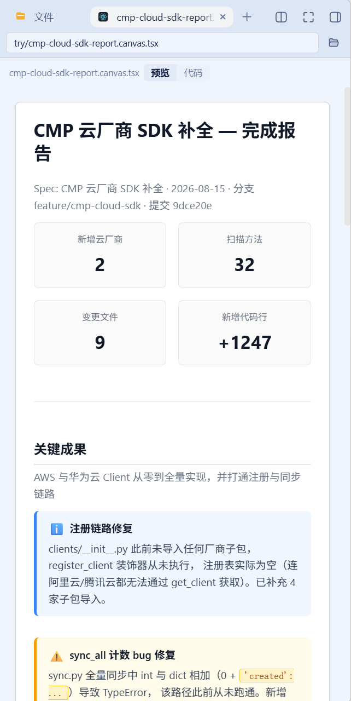

# dsh-canvas-tsx-sidebar

DSH（DeepSeek Harness）Web 插件 —— **dsh-better-sidebar 消费插件**。

把工作区里的 Qoder Canvas `*.canvas.tsx` **静态解析**为结构化页面，在 DSH 右侧栏渲染。

> **纯静态管线**：不执行 canvas 源码。无 `eval`、无 `new Function`、无 bundler、无沙箱 iframe。
> 解析在浏览器侧用自研的轻量递归下降解析器完成（零解析器依赖）。

本仓库还附带一个 **Skill**：`skills/writing-qoder-canvas/`，让 LLM 会写这种格式。见 [集成 Skill](#集成-skill让-llm-会写-canvastsx)。



---

## 前置

- DSH `dsh web` 可正常运行
- 已安装 [dsh-better-sidebar](https://www.npmjs.com/package/dsh-better-sidebar)（`>=0.19.1`）

未安装 better-sidebar 时插件**完全惰性**：两个注册被静默跳过，不影响 DSH 其他功能。

## 安装

### 方式 A（推荐，官方 CLI）

```sh
dsh plugin --profile <profile> add <dsh-canvas-tsx-sidebar-0.1.0.tgz>
```

`dsh` 会把本包加入 `dsh.profile.bundles`，启动时由本包自带的 `cordis.patch.yml`
插入 loader entry，并按 `entry.name` 注册下发客户端 bundle。

### 方式 B（手动，备选）

1. 把包复制到 `~/.dsh/profiles/<profile>/node_modules/dsh-canvas-tsx-sidebar`
   （或在 profile 的 `package.json` 的 `dependencies` 里加 `"dsh-canvas-tsx-sidebar": "link:<插件路径>"`）；
2. 把下面这行追加到 `~/.dsh/profiles/<profile>/cordis.patch.yml`：

   ```yaml
   - insert:
       - id: dsh-canvas-tsx-sidebar
         name: dsh-canvas-tsx-sidebar
   ```

3. 在 profile 目录执行 `pnpm install`。

> ⚠️ **方式 A 与方式 B 二选一，勿重复注册。**

### 生效

4. **重启 `dsh web`** —— 新增 bundle 需要宿主侧重载（对**已挂载**插件的 client 改动才只热加载）；
5. 浏览器硬刷新（Ctrl+Shift+R）。

可用 `pwsh -NoProfile -File ./scripts/mount-check.ps1` 复查挂载状态。

## 使用

两个入口：

| 入口 | 触发方式 | 行为 |
|---|---|---|
| **文件查看器**（接管） | 在文件树里点开任意 `.tsx` | `.canvas.tsx` → 结构化页面 + `预览/代码` 切换；其他 `.tsx` → 源码视图 |
| **页签** | 右侧栏 `+` 菜单 → **Canvas 报告** | 手动输入路径查看，不必先在编辑器里打开文件 |

文件查看器可在 Side 卡设置里关闭，关闭后该类型回落内置的代码查看器。

打开**某一个**文件就渲染**那一个**文件 —— 插件不扫描工作区。

### 为什么文件查看器必须认领整个 `.tsx`

`exts: ['tsx']` 是唯一可行的认领方式，代价是它也会认领非 canvas 的 `.tsx`。证据全部来自
better-sidebar 源码与生态实测：

| # | 约束 | 证据 |
|---|---|---|
| L1 | `extOf()` 只取最后一段扩展名 → `extOf('a.canvas.tsx') === 'tsx'` | `src/client/paths.ts:80-85` |
| L2 | `exts: ['tsx']` 会认领工作区**全部** `.tsx`，且 priority 0 压掉内置 `code`（-100）的 CodeMirror | `service.ts:847-875` |
| L3 | `detect` 只在 `head` 字节可用时调用，而 `head` 仅来自二进制 `fs.read` —— 文本 `.tsx` 永远走不到该分支 | `service.ts:860` |
| L4 | descriptor 认领后 `component` 必须渲染，**无委托/回退 API** | `EditorHost.tsx:349,486` |
| L5 | 生态插件 `dsh-code-nav` 的 `LANG_EXT` **已含 `tsx`** 并以 `priority: 10` 认领 | `dsh-code-nav/src/lang-registry.js` |

→ `.canvas.tsx` 的判定只能在自有组件内完成。因此：**查看器认领全部 `.tsx`**（canvas 走页面，
其余走源码），**页签**作为不经过文件认领的第二入口保留。

## 集成 Skill：让 LLM 会写 `.canvas.tsx`

`skills/writing-qoder-canvas/` 是一个**自包含、可整体搬迁**的 Skill：

```
skills/writing-qoder-canvas/
  SKILL.md                      # 触发条件、文件骨架、五条铁律、红旗清单
  references/components.md      # 真正会渲染的 38 个 tag + 每个的 prop（机器校验）
  references/expressions.md     # 静态解析器的封闭规则：什么值能活下来
  references/layout.md          # 为 ~400px 侧栏写作（而不是为 960px 预览）
  examples/status-report.canvas.tsx   # 可渲染的范本，由测试保证零降级
```

### 它为什么不会说谎

文档会漂移，所以这里的每条断言都接到源码上（`tests/skill.spec.ts`）：

- `components.md` 的支持清单必须**逐项等于** `render.tsx` 的 `case` 标签（38 个，含顺序）；
- "不支持"清单里的任何名字都不能出现在渲染器里；
- `examples/status-report.canvas.tsx` 必须**零降级**渲染 —— 无 `unsupported` 提示、无未知组件虚线框。

文档与实际能力不一致时，`pnpm test` 会失败。

### 怎么安装到 DSH

DSH 从固定的一组 root 发现 Skill，且 Skill **必须恰好一层深**：`<root>/<name>/SKILL.md`。
嵌套的 `**/SKILL.md` 不会被发现（provider 用 chokidar 监听每个 root，`depth: 1`）。

| rank | 来源 | 路径 |
|---|---|---|
| 100 | `project-dsh` | `<projectRoot>/.dsh/skills` |
| 200 | `project-agents` | `<projectRoot>/.agents/skills` |
| 300 | `custom` | DSH 配置 `customSkillDirs` |
| 400 | `user-dsh` | `~/.dsh/skills` |
| 500 | `user-agents` | `~/.agents/skills` |
| 600 | `bundled` | `$DSH_BUNDLED_SKILL_DIR` |

```powershell
# 默认：装到 ~/.agents/skills，用 junction（无副本、无漂移）
pwsh -NoProfile -File ./scripts/install-skill.ps1

# 装到别处；-Copy 则做一份可独立搬迁的真实副本（会漂移，改完要重跑）
pwsh -NoProfile -File ./scripts/install-skill.ps1 -Target UserDsh
pwsh -NoProfile -File ./scripts/install-skill.ps1 -Path D:\some\skills -Copy

# 卸载
pwsh -NoProfile -File ./scripts/install-skill.ps1 -Uninstall
```

provider 会监听 root，**无需重启 `dsh web`**：装完即出现在下一次会话的 skill catalog 里。

**默认用 junction 而不是复制**，因为复制会漂移 —— 这个工作区在 `memport` 上已经吃过一次
"三份副本互不同步" 的教训。junction 让仓库里的那份始终是唯一权威源。

> `skills/` **不在 `package.json` 的 `files[]` 里**，属于仓库资产而非 npm 发布物。

## 版本约束

在 `dsh-better-sidebar@0.19.0 / 0.19.1` 上，`openTab({ path })` 的 path seed 会被改道到
文件编辑器，**组件型页签不会挂载**（上游 #632，0.19.2+ 修复）。因此本插件**不依赖 path seed**，
而是自行经 `/sidebar/api`（`session.cwd` → `fs.tree` → `fs.read`）解析目标文件——
该实现对 0.19.2+ 同样成立。

## 皮肤与主题

**插件外壳**（页签、设置卡、按钮）只消费 DSH 的 `--dsw-alias-*` 令牌，自动跟随全部皮肤与深浅色。

**canvas 文档子树是例外，且是有意的**：`.canvas.tsx` 描述的是一张固定版式的纸，颜色由作者决定，
按皮肤重新着色会改变报告本身的样子。因此 `styles.ts` 用字面色值，并且**每条选择器都限定在
`.dsh-canvas-doc` 之下**，不会泄漏到宿主 UI（`tests/render.spec.tsx` 守护作用域，
`tests/purity.spec.ts` 守护注册面）。

## 已知限制

- 解析为**轻量自研解析器**，非编译器级精度。泛型、装饰器、任意调用不做建模，一律降级，
  但**永不抛错**。
- 值的解析是**封闭规则集**（详见 `skills/writing-qoder-canvas/references/expressions.md`）。
  支持的：字面量、`as const` / `as T` 断言、模块级与函数体顶层的字面量 `const`、
  对静态数组的 `ARR.map(x => 字面量)` 投影、`canvasImage('字面量')`。
  不支持的（**不做求值**）：条件表达式、函数调用、成员链、模板插值、算术、`new`、`await`、
  嵌套块内的 `const`、跨模块 `import` 的数据。
  - 非字面量**子节点** → 渲染为行内降级条，片段原文可见；
  - 非字面量**属性** → 该属性被丢弃，名字记录在 IR 的 `unresolved` 里，其余属性照常渲染。
- 小写 tag 一律作为原生 HTML 透传；只有**大写且未映射**的组件才渲染为带名字的虚线框。
- 页签渲染为**只读**。
- **解析器比编译器更宽容**：Qoder SDK 要求作者用 IDE 的 "Canvas TypeScript check" 修掉诊断，
  但真实文件未必干净。本插件遇到非法 TSX **不报错、不中断**，只降级出问题的那个节点。
  可用 `node scripts/syntax-oracle.cjs <file.canvas.tsx>` 查看权威诊断。

  > 实测：仓库自带的样本 `cmp-cloud-sdk-report.canvas.tsx` 第 46 行
  > `{'created': ...}` 即为非法 TSX（TypeScript 报 **TS1005 + TS1381** —— 裸展开运算符）。
  > 本插件把该处降级为一个行内标记，其余 147 行照常渲染。

## JSX 空白语义

文本子节点严格按 React 的 `cleanJSXElementLiteralChild` 语义折叠：

- 非首行的**前导缩进一律剥离**；
- **末行的尾随空格保留** —— 这个空格是承重的，它分隔文本与紧随其后的表达式容器
  （例：`…相加（0 + {'created': ...}）…` 中的空格，去掉会让两段粘在一起）。

## 开发

```sh
pnpm install
pnpm typecheck     # tsc（含仅客户端的零 Node 依赖校验）
pnpm test          # vitest
pnpm build         # tsc dts + tsdown（宿主半 + 客户端 bundle）
pnpm run audit:bundle   # 审计真实构建产物
```

## 开发脚本

| 脚本 | 用途 |
|---|---|
| `scripts/dump-ir.ts` | 导出某文件的 IR 大纲 / JSON / 黄金夹具（`--write`） |
| `scripts/syntax-oracle.cjs` | 用**真实 TypeScript 编译器**判定源文件是否合法 TSX（`typescript` 仅为 devDependency，不进 bundle） |
| `scripts/audit-bundle.cjs` | 审计真实构建产物：内建模块泄漏、重解析器、`eval`、越界注册 |
| `scripts/mount-check.ps1` | 检查/修复 profile 挂载（纯 ASCII，兼容 Windows PowerShell 5.1） |
| `scripts/install-skill.ps1` | 把 `skills/writing-qoder-canvas` 装到某个 DSH skill root（默认 junction） |
| `scripts/component-census.cjs` | 独立组件普查（不依赖硬编码组件表，跨行感知） |
| `scripts/corpus-stats.ts` / `format-economics.ts` / `audit-corpus.ts` / `corpus-gaps.ts` | 语料统计与格式经济学实测（`docs/canvas-format-rules.md` 的数字来源） |
